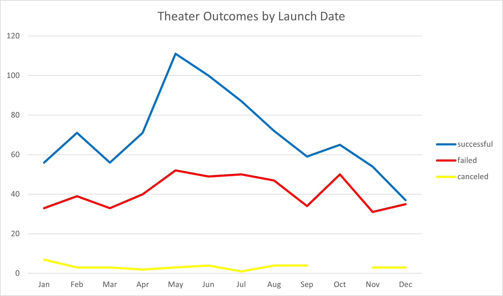
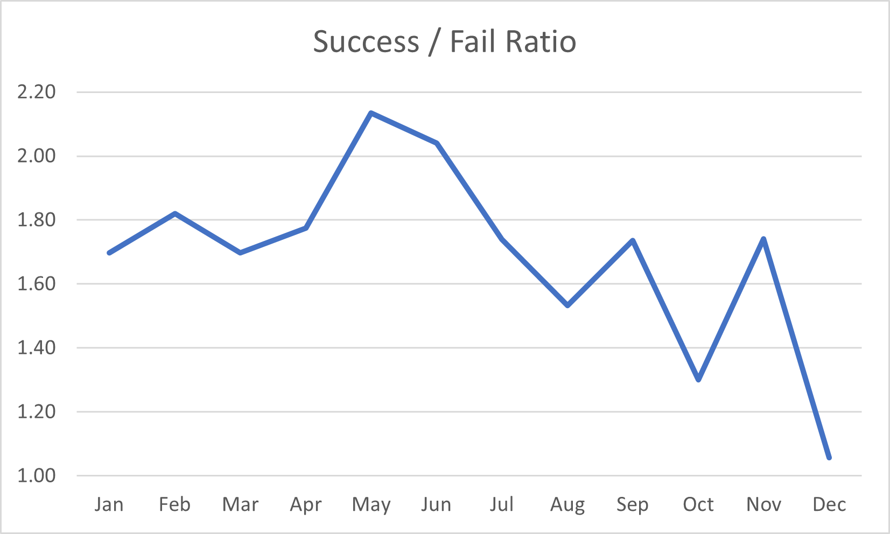
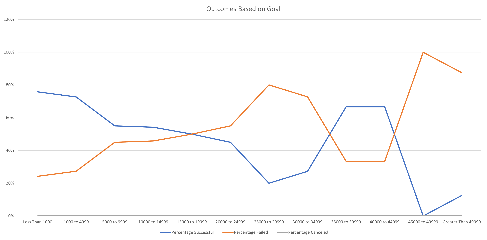
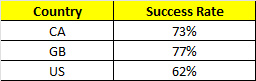
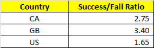

@@ text in purple (and bold)@@

# Kickstarting with Excel
@@Structure, Organization, and Formatting (8 points)@@
@@The written analysis has the following structure, organization, and formatting:@@

@@There is a title, and there are multiple paragraphs (2 pt).@@
@@Each paragraph has a heading (2 pt).@@
@@There are subheadings to break up text (2 pt).@@
@@Links are working, and images are correct and displayed where appropriate (2 pt).@@
## Overview of Project
@@Analysis (12 points)@@
@@The written analysis has the following:@@
@@Explain the purpose of this analysis.@@  
This project was the first challenge in the Carleton University Business Analytics and Data Visualization Boot Camp.  Module 1 of the first Unit of the boot camp was intended to enhance our Microsoft Excel skills in a number of areas including statistical modeling, forecasting and prediction.  These skills included the use  pivot tables, charts and graphs to improve the audiences understanding of what the analysis had revealed.
### Purpose
@@Overview of Project@@  
@@The purpose and background are well defined (2 pt).@@  
The purpose of the specific project within this module was to assist a client, Louise who came close to, but failed to meet her goals in funding a play named Fever.  It is not clear why Louise wants this information but I am assuming that she probably want to make another more fucsed attempt to fund this play.  As we strive for perfection we will definately be giving Lousie the best information available.
## Analysis and Challenges
@@Explain how you performed your analysis using images and links to code, as well as any challenges you encountered and how you overcame them. If you had no challenges, describe any possible challenges or difficulties that could be encountered.@@

@@Analysis and Challenges@@
@@The overview of the analysis is well described with screenshots (2 pt).@@  
The analysis followed the general process of breaking the available data into catagories and subcategories that were appropriate to Louise's needs.  She was interested in thetre and in particular plays.  I looked at two specific factor that may influence the goal outcome, those being lauch date and the actual goal amount.  This data is presented in line chart to show trending.  I also did an anaylsis by country and extract three candiates to discuss with Louise.  The country data is presented in two small tables.

@@Challenges or difficulties that were encountered, and how they were overcome, are well explained. If there were no difficulties, describe any possible challenges or difficulties that could be encountered (2 pt).@@  
I created a number of views to verify the analysis was correct and meaningful.  I did observe that there was an issue in the project define requirements in that the Outcomes based on Goals last row said Greater than 50000 and the second last row said 45000 to 49999.  This did not affect the values because there were no goals of exactly 50000 for theatres - it would cause issues for other campainge.  I correct this I changed the goal to be Greater than 49999.  Another issue was that I wanted to give Louise better data about what she could do in the future so I created a couple of pivot table that allowed be to extract data that I specifically wanted to discuss with her.  The last item is that the first row was a much smaller range that most others and the last was of course so a line chart could be somewhat deciving - the trend in meanful zones was however valid and I have address this in the explaination.
### Analysis of Outcomes Based on Launch Date
@@Two conclusions are made about the Theater Outcomes by Launch Date (2 pt).@@  
The analysis of the database included a significant number of project in the theatre category and most of those were from the subcategory plays.  The campainge for the play Fever was launched in June may have been slightly late.  In the graphs below you can see that May appears to be the best time of year to have a sucessful champainge.  This is particular true when you analysis the success and failure ratio - the decline from May to the end of the year is significant.  You will also notice that while the success raises from Janurary to May it is not as step as raise and then you find that in May and June the largest numbers of champainges are launch.  I would condulde the following:
- When you launch a champainge to early in the year it is possible that investors may be inclined to hold of to see what other opportunites may present themselves
- If you wait too late the launch than you are likely the find that many investor have already commited their fund to another project  

### Analysis of Outcomes Based on Goals
@@One conclusion is made about the Outcomes based on Goals (2 pt).@@
The analyis of the database shows that Louise champainge, at less than $3,000 was set at a very reasonable goal level.  The only goal level that performed better was at less than a $1,000.  However if you consider that most ranges were $4,999 you could in fact say the Louise was in the highest success range.  You could also say that while the less than $1,00 range was the most successful at raising money, it was also somewhat of an outlier in that it was likely too small a goal to acheive anything of importannce.  I would argue that Lousie was well positioned in term os goals to be successful.  There are very few champainges with goals that exceed $25,000 and in fact it is unlikely that the results above this range are os any statictical significance nased on the small sample size.  Conculsion that could be drawen are:
- There is a clear trend that demonstrates that the large the goal the leass likely it is to get sufficent pledges
- The other interesting observation is that there seems to be a significant financial threshold at the $5,000 goal level were investor tend to wain

### Analysis of Outcomes Based on Country

So what do we know?
- Lousie was a little late in the year to seek investment, but still in a fairly succesful time of the year
- Louise's goal was reasonable in terms of what she was looking to raise
- Unfortunately Louise fail short of her goal

Not wanting to leave Louis without a more significant plan to improve her chances next time I decide to have a look at the market in which she was competing.  Using a pivot table with countries as row I noticed that three countries were worth looking at for the theater/play category: Canada, Great Britan and the United States.  The tables below yeild some valueable information for Louis:
- While the United Staes has by far the most champainges the overall success rate is only 62%
- In Great Britain the success rate is a whooping 77% overall with successes 3.4 times more likely than failures
- If Louise feels the logicals of a launch in Great Britian is too difficult she might consdier Canada as an option due to the favourable investnebt environment and the relative proimity to the US
-

### Challenges and Difficulties Encountered
@@There is a summary of the limitations of the dataset, and there is a recommendation for additional tables or graphs (2 pt).@@  
## Results

- What are two conclusions you can draw about the Outcomes based on Launch Date?

- What can you conclude about the Outcomes based on Goals?

- What are some limitations of this dataset?

- What are some other possible tables and/or graphs that we could create?
